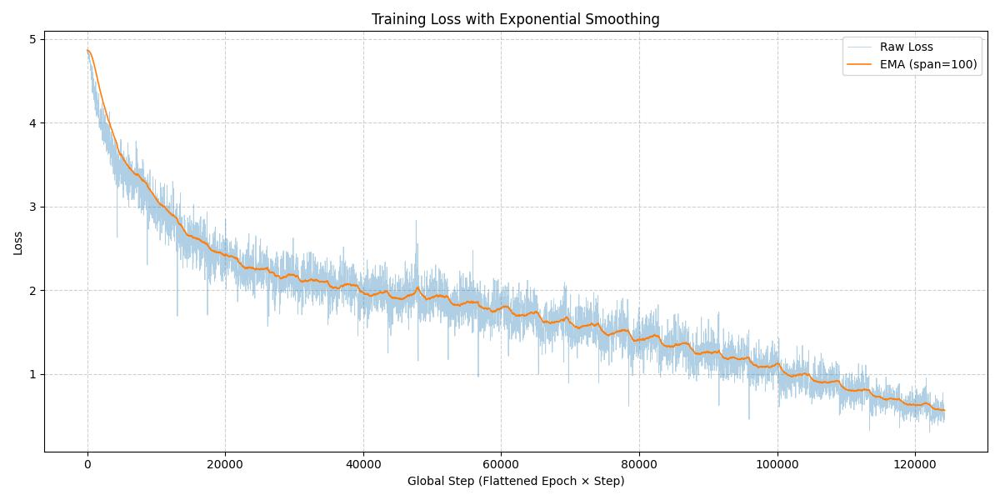
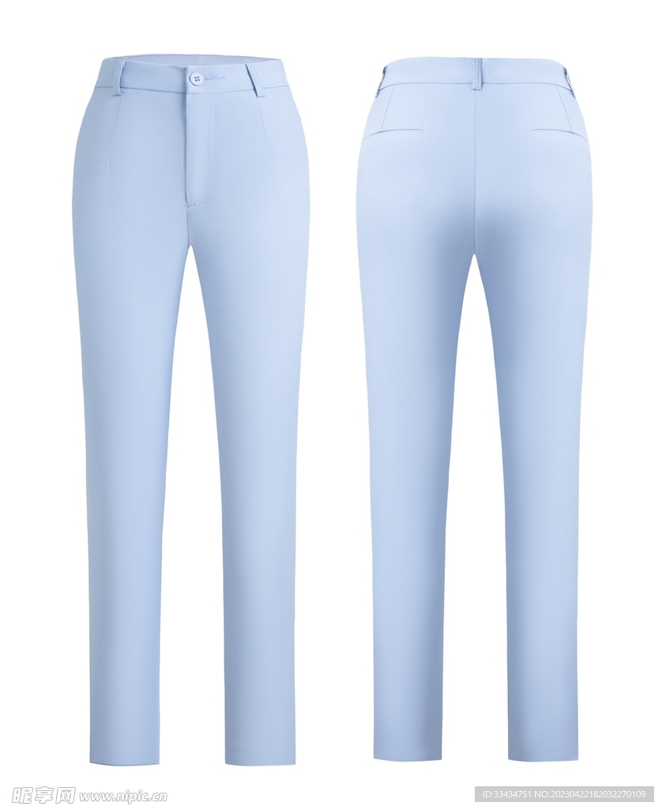
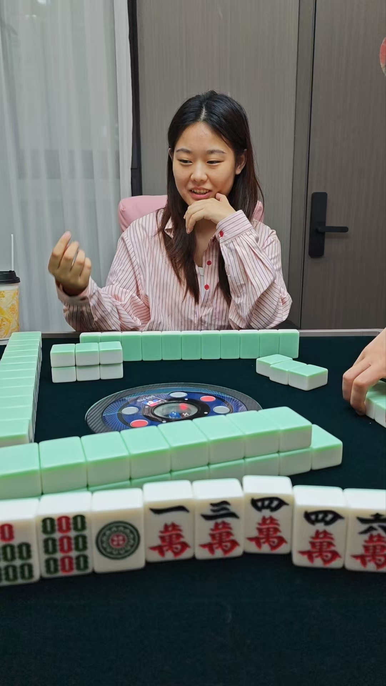

# ThinkCLIP —— Vision-Language Contrastive Learning

> A lightweight CLIP implementation that combines a Vision Transformer(VIT) image encoder
> and a GPT-style text encoder, trained with contrastive learning to align visual and language representations.

## Model Overview

🖼 Vision Encoder - VIT
- Patch embedding
- Multi-layer Transformer
- Flash attention support(is_flash = True)
- The ***[CLS]*** token represents global image semantics

💬 Text Encoder — GPT
- Token embedding + rotary positional embeddings
- Multi-layer Transformer
- The ***[EOS]*** token representation is used as the text embedding

🔗 Alignment Head
- Linear projection to a shared embedding space (align_dim = 512)
- Feature normalization and learnable temperature scaling
- Contrastive loss objective:
<p align="center">
L = 1/2 * [CE(logit_img, y) + CE(logit_text, y)]
</p>

## ⚙️Configuration
```python
@dataclass
class Config:
    # common
    eps: float = 1e-5
    is_flash: bool = True
    align_dim: int = 512
    # img encoder
    img_size: int = 224
    patch_size: int = 16
    channel: int = 3
    img_dim: int = 384
    img_n_heads: int = 6
    img_n_layers: int = 12
    num_classes: int = None
    img_dropout_rate: float = 0.1
    # text encoder
    vocab_size: int = 6400
    max_seq_len: int = 64
    text_dim: int = 768
    text_n_heads: int = 12
    text_n_kv_heads: int = 3
    text_n_layers: int = 12
    text_dropout_rate: float = 0.1
```

## Quick Start
### Requirements
```bash
pip install -r requirements.txt
```

### Train
datasets: [LLaVA-Pretrain](https://huggingface.co/datasets/liuhaotian/LLaVA-Pretrain/tree/main)
```bash
python 1.train_pretrain.py
```

### Eval
```bash
python 2.eval_clip.py
```

## Loss Curve


## Evaluation


```text
text = [
    'Happy New Year' + '<|im_end|>',
    'China' + '<|im_end|>',
    'red' + '<|im_end|>',
    'envelope' + '<|im_end|>',
    'red envelope' + '<|im_end|>'
]

pred:
    Happy New Year: 0.11%
    China:          0.05%
    red:            1.68%
    envelope:       6.03%
    red envelope:   92.13%
```



```text
text = [
    'pants' + '<|im_end|>',
    'plane' + '<|im_end|>',
    'car' + '<|im_end|>',
    'blue shirt' + '<|im_end|>',
    'shoe' + '<|im_end|>',
    'Light blue pants' + '<|im_end|>',
    'Dark blue pants' + '<|im_end|>',
]

pred:
    pants:              2.47%
    plane:              0.00%
    car:                0.00%
    blue shirt:         0.81%
    shoe:               0.00%
    Light blue pants:   65.72%
    Dark blue pants:    31.00%
```



```text
text = [
    'girl playing mahjong' + '<|im_end|>',
    'boy playing mahjong' + '<|im_end|>',
    'girl' + '<|im_end|>',
    'mahjong' + '<|im_end|>',
    'green mahjong' + '<|im_end|>',
    'playing mahjong' + '<|im_end|>',
]

pred:
    girl playing mahjong:  88.30%
    boy playing mahjong:   11.42%
    girl:                  0.17%
    mahjong:               0.10%
    green mahjong:         0.00%
    playing mahjong:       0.01%
```


